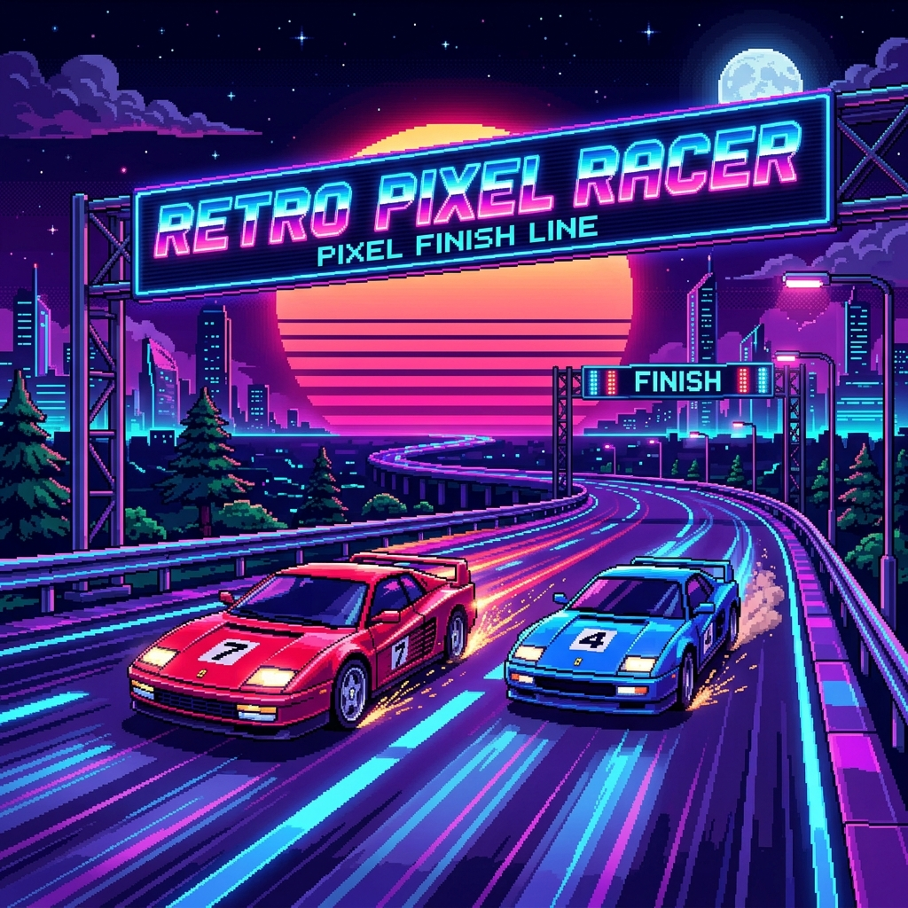
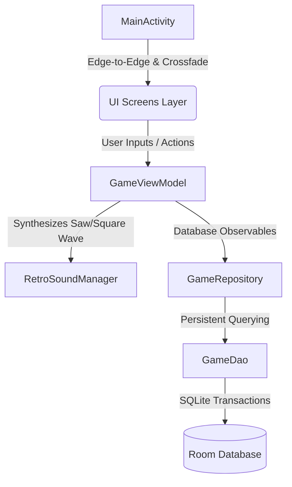

<div align="center">
  
</div>

<br>

<div align="center">
  
  # 🏎️ Retro Pixel Racer
  
  [](https://github.com/jeiel85/retro-pixel-racer-android)
  [%2B-orange.svg?style=for-the-badge&logo=android)](https://developer.android.com)
  [](https://jeiel85.github.io/retro-pixel-racer-android/)
  [](https://github.com/jeiel85/retro-pixel-racer-android/blob/main/LICENSE)
  
</div>

---

**Retro Pixel Racer**는 80년대 고전 아케이드의 강렬한 레이싱 재미를 안드로이드 모바일 환경에서 현대적인 Jetpack Compose 기술로 우아하게 재해석한 2D 픽셀 아트 레이싱 게임입니다. 

화려한 네온 신스웨이브 비주얼 필터와 기기 내부 오디오 버퍼로 직접 주파수를 합성하는 **8비트 사운드트랙 제너레이터**, 다채로운 차량 업그레이드 모듈, 그리고 박진감 넘치는 가상 글로벌 멀티플레이 모드로 질주의 아드레날린을 느껴보세요!

> 🌐 **공식 웹 페이지**: [https://jeiel85.github.io/retro-pixel-racer-android/](https://jeiel85.github.io/retro-pixel-racer-android/)  
> 브라우저에서 직접 키보드와 터치로 플레이 가능한 **인터랙티브 3D 캔버스 레이싱 미니게임**과 플레이 스토어 심사용 개인정보처리방침을 확인하실 수 있습니다.

---

## 🕹️ 핵심 플레이 모듈

<table>
  <tr>
    <td width="50%">
      <h3>🏎️ 차고지 & 커스텀 차량 튜닝</h3>
      <p>Classic Red, Vortex Blue, Cyber Green 등 고유 외형을 지닌 차량들을 차고지(Garage)에서 선택하고 코인을 소모하여 성능을 업그레이드할 수 있습니다.</p>
      <ul>
        <li><strong>ENGINE:</strong> 가속 속도 인자 증강</li>
        <li><strong>HANDLING:</strong> 좌우 조향 물리 팩터 강화</li>
        <li><strong>SPEED:</strong> 차량의 절대 한계 최고 속도 돌파</li>
      </ul>
    </td>
    <td width="50%">
      <h3>🎵 실시간 8비트 사운드 신시사이저</h3>
      <p>본 게임은 용량을 차지하는 외부 오디오 에셋 파일을 사용하지 않습니다! 안드로이드 <code>AudioTrack</code>을 통해 정밀 <strong>saw/square 파형 주파수를 실시간 합성</strong>하여 레트로 엔진 굉음과 효과음을 생생하게 절차적으로 출력합니다.</p>
    </td>
  </tr>
  <tr>
    <td width="50%">
      <h3>🏆 글로벌 리더보드 & 매치메이킹</h3>
      <p>초기 Green Valley 숲길부터 Pixel Neon Grid 등의 고난이도 코스들을 잠금 해제해 나가며, 가상 글로벌 플레이어들과 기록 경주를 하거나 멀티플레이 로비에서 실시간 매치 듀얼을 펼칩니다.</p>
    </td>
    <td width="50%">
      <h3>📅 일일 스페셜 임무 & Room DB</h3>
      <p>매일 새롭게 갱신되는 4종의 스페셜 미션을 완수하여 업그레이드용 골드를 수집하세요. 모든 게임 정보 및 플레이어 설정 정보는 로컬 Room Database에 완벽히 오프라인 샌드박스로 안전하게 기록됩니다.</p>
    </td>
  </tr>
</table>

---

## 🏗️ 시스템 아키텍처 흐름도



---

## 🚀 빠른 시작 가이드 (Quick Start)

### 1. 개발 및 빌드 환경 요구사항
* **Android Studio**: Ladybug (2024.2.1) 이상 권장
* **JDK**: Version 17 이상
* **Android SDK**: Compile SDK 36 (API 36), Min SDK 24 이상

### 2. 로컬 빌드 및 컴파일 방법
프로젝트 저장소를 로컬 컴퓨터로 클론한 후, 다음 터미널 명령어들을 활용해 빌드와 컴파일을 진행할 수 있습니다.

```bash
# 1. 저장소 클론
git clone https://github.com/jeiel85/retro-pixel-racer-android.git
cd retro-pixel-racer-android

# 2. 로컬 환경 변수 설정
# 프로젝트 루트 디렉토리에 .env 파일을 생성하고 API 키를 설정합니다 (필요 시)
echo "GEMINI_API_KEY=your_gemini_api_key" > .env

# 3. Kotlin 소스코드 점검 및 컴파일
./gradlew compileDebugKotlin

# 4. 단위 테스트 실행
./gradlew test

# 5. 디버그용 APK 생성
./gradlew assembleDebug
```

---

## 📦 구글 플레이 릴리즈 배포 태스크

본 프로젝트에는 플레이 스토어 배포본 생성을 완벽히 자동화하기 위해 **커스텀 Gradle 태스크**가 구축되어 있습니다.

```bash
# 플레이 스토어 배포용 Signed AAB 빌드 및 데스크톱 배포 자동화 실행
./gradlew :app:exportReleaseToDesktop
```

### 💎 배포 태스크 동작 원리
1. **R8 최적화 컴파일**: 릴리즈 최적화와 난독화 코드를 R8 엔진을 통해 컴파일하여 바이너리 용량을 50% 이상 극도로 축소합니다.
2. **배포 서명 연동**: 로컬 `debug.keystore` 또는 환경 변수 기반 릴리즈 서명키를 바이너리에 탑재합니다.
3. **데스크톱 배포본 내보내기**: 빌드가 완료되면 사용자 바탕화면에 **`Build` 폴더(`C:\Users\jeiel\Desktop\Build`)**를 생성하고, 그 안에 아래 두 에셋을 단일 폴더로 묶어 깔끔하게 내보냅니다.
   * `RetroPixelRacer-v{versionName}-vc{versionCode}.aab` (심사용 AAB 번들)
   * `RetroPixelRacer-v{versionName}-vc{versionCode}-release-notes.txt` (BCP-47 형식 한글 `<ko-KR>` 및 영문 `<en-US>` 통합 출시 노트)

---

## 🔒 개인정보 처리 개요 (Privacy Policy)
**Retro Pixel Racer**는 완전한 **로컬-퍼스트(Local-First) 오프라인 모바일 게임**입니다. 어떠한 네트워크 위치 정보 수집, 유저 트래킹, 제3자 분석 SDK 모듈도 포함되어 있지 않으며, 기기 내부 샌드박스 보안 규칙을 준수합니다. 상세 내용은 [Privacy Policy](https://jeiel85.github.io/retro-pixel-racer-android/privacy.html)를 참고해 주세요.
